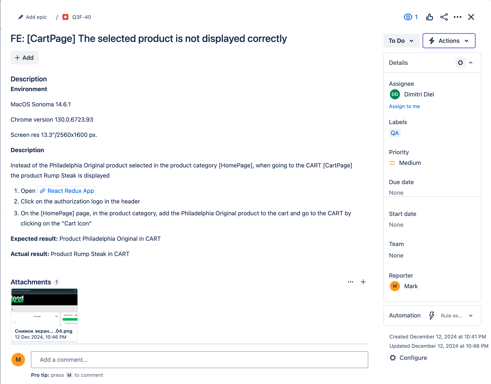

# 🍔 FoodNow: Testing Project

## Project Overview

FoodNow is a web application for online food ordering. The project aims to comprehensively test the FoodNow application to ensure its quality and reliability. The testing process began with manual testing of the registration functionality using various Test Design techniques, primarily Boundary Value Testing and Equivalence Partitioning techniques. The test automation project utilizes Selenium, Cucumber, Postman, Newman, TestLink, REST Assured, and Jenkins for various types of testing, including UI, API, and integration testing. Logging and screenshot capture are implemented in the project to facilitate tracking and documenting bugs.

## ✨Key Features

The FoodNow application offers the following features:

* 📝 User registration and authorization
* 🛍️ Viewing and sorting products
* 🛒 Adding products to the cart
* 📦 Placing an order
* 💳 Online payment

## 🛠️ Technologies Used

* **Testing:** Selenium 4.25.0, Postman, Newman, TestLink, REST Assured, Jenkins, Jira, Allure
* **Programming Language:** Java 17
* **Build Tool:** Gradle
* **Logging:** Logback Classic 1.5.9
* **Others:** WebDriverManager 5.9.2


## 📂 Project Structure

The project includes logging and screenshot capture to facilitate bug tracking. Key aspects of the project structure:

* **`/src/main/java/com/foodnow/pages`**: Contains Page Objects for interacting with the web application. Examples:
  * `RegisterPage`: Contains the method `enterPersonalData()` for comprehensive testing of registration fields.
  * `LoginPage`: Contains the method `loginExistedUser()` for simplified login testing.
  * `AddProductPage`:  Provides methods such as `clickFoodCategory()` и `clickAddSteakToCart()` for interacting with product categories and adding items to the cart.
  * `CartPage`:  Offers the method `addProductToCart()` or adding products to the cart.
* **`/src/test/java/foodnow/tests`**: Contains corresponding test classes.

## ⚙️ Installation and Setup

### 🔧 Required Components

* **Java JDK** (17 or higher): Download from [Oracle](https://www.oracle.com/java/technologies/javase/jdk17-archive-downloads.html) or use a distribution such as [Adoptium](https://adoptium.net/).
* **Gradle:**  Download from [Gradle](https://gradle.org/install/) or use a package manager (e.g., Homebrew, SDKMAN). If the project includes the Gradle Wrapper (`gradlew` and `gradlew.bat`), you can use `./gradlew` directly.
* **Git:** Download and install from [Git](https://git-scm.com/downloads).

### 📥 Steps

1. Clone the repository:
   ```sh
   git clone https://github.com/MicusHub/FoodNow.git
2. Navigate to the project directory: 
   ```sh
   cd FoodNow
3. Build the project and install dependencies: `./gradlew build` (or `gradlew build` on Windows)
4. Ensure the build.gradle file includes all required dependencies:
   ```gradle
   dependencies {
   implementation group: 'org.seleniumhq.selenium', name: 'selenium-java', version: '4.25.0'
   implementation group: 'org.testng', name: 'testng', version: '7.10.2'
   implementation group: 'io.github.bonigarcia', name: 'webdrivermanager', version: '5.9.2'
   implementation group: 'ch.qos.logback', name: 'logback-classic', version: '1.5.9'
   }
5.  Run the tests: `./gradlew test` (or `gradlew test` on Windows)

## 🖼️ Usage Examples

Organizing screenshots to identify bugs:
   ```java
   public String takeScreenshot() {
   File screenshot = new File("src/test_screenshots/screen-" + System.currentTimeMillis() + ".png");
   try {
   File tmp = ((TakesScreenshot) driver).getScreenshotAs(OutputType.FILE);
   Files.copy(tmp.toPath(), screenshot.toPath());
   } catch (IOException e) {
   logger.error("Failed to save screenshot", e);
   throw new RuntimeException(e);
   }
   return screenshot.getAbsolutePath();
   }
   ```
## 🛑 Known Issues and Limitations

* Images do not display correctly after load testing, which may potentially affect some tests.

## 🐞 Example of a Bug Report in Jira
[](./screenshots/F21DFEF5.PNG)

## 📄 Documentation

* [Test Plan](https://docs.google.com/spreadsheets/d/1fhztzIxPEVHzE2q1KZDFKaFSvn-vgOVX/edit?usp=sharing&ouid=103276708346142431414&rtpof=true&sd=true)
* [User Stories](https://docs.google.com/spreadsheets/d/1PDMytQXr9YjGRr7cQNpCL1IRamwxGZwR/edit?usp=sharing&ouid=103276708346142431414&rtpof=true&sd=true)
* [Use Cases](https://docs.google.com/document/d/1aBOmoolJJWEyk12gwnZOpHPtJZvVPdxo/edit?usp=sharing&ouid=103276708346142431414&rtpof=true&sd=true)
* [Database Schema](https://drawsql.app/teams/vera-team/diagrams/order-food)
* [TestLink](./screenshots/testLink.png)
* [Postman Test Run](https://drive.google.com/file/d/1V8IPwh7pYfbmQC2rEsfBjDsKVhlLnyFo/view?usp=sharing)
* [Example Bug reports](./bugs.md)
* [REST Assured](./screenshots/wn63-89-1.png)

## 📜 License

This project is licensed under the MIT License — see [LICENSE](https://opensource.org/license/mit) for details.

<!-- end list -->